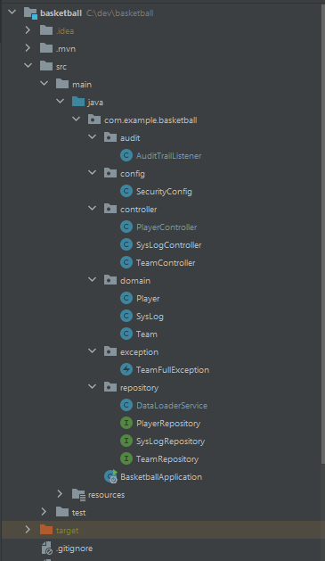

## Technology
- Java 8
- Spring Boot 2.7.9
- H2 Database
- Graphql

## Project Structure



This is sample project with Spring Boot GraphQL. We can create team, player with a team and delete player. Maxiumum
basketball team's roster can be 15.

There are secured endpoints. Credentials are
```
User1: username: "admin", password: "pw"
User2: username: "admin2", password: "pw2"
```
## Entities (Domain)

We store data in a database using **_JPA and hibernate_**. We have entities in domain package. They are Player, Person
and SysLog. SysLog is for storing changes on entities.

**_Logging all changes on entites's_** approach is in AuditTrailListener. We have EntityListener annotation on which we want log it.
Then we are creating new SysLog object when object is created, updated or deleted.

### GraphQL Schema
```
schema {
query: Query,
mutation: Mutation
}

type Player {
id: ID!
firstname: String!,
lastname: String!,
position: Position,
team: Team
}

enum Position {
POINT_GUARD,
SHOOTING_GUARD,
SMALL_FORWARD,
POWER_FORWARD,
CENTER,
}

type SysLog {
id: ID!
domain: String,
process: String,
modifiedBy: String,
modifiedAt: String,
body: String,
}

type Team {
id: ID!
name: String!,
conference: String,
rosterSize: Int
}

type Query {
getAllPlayers(page: Int, size: Int):[Player],
getAllTeams:[Team]
getAllSysLogs:[SysLog]
}

type Mutation {
saveTeam(name: String!, conference: String): Team
savePlayer(firstname: String!, lastname: String!, position: Position, teamId: String): Player
deletePlayer(id: Int): Boolean
}
```


### Run the following command in a terminal window directory:
```
./mvnw spring-boot:run
```

### GrapHQL endpoint is http://localhost:8080/graphiql 

Here is the example for GraphQL Schema.
```
query getAllPlayers {
  getAllPlayers(page: 0, size: 15) {
    id
    firstname
    lastname
    position
    team {
        id
      translatedName: name
    }
  }
}

query getAllSysLogs {
  getAllSysLogs {
    domain
    process
    body
    modifiedBy
  }
}

mutation deletePlayer {
  deletePlayer(id: 6)
}

mutation savePlayer {
  savePlayer(firstname: "Brook",
  lastname: "Lopez",  
  position: CENTER, 
  teamId: "2"){id}
}

mutation saveTeam {
  saveTeam(name: "Chicago Bulls",
  conference: "East"){id}
}
```


